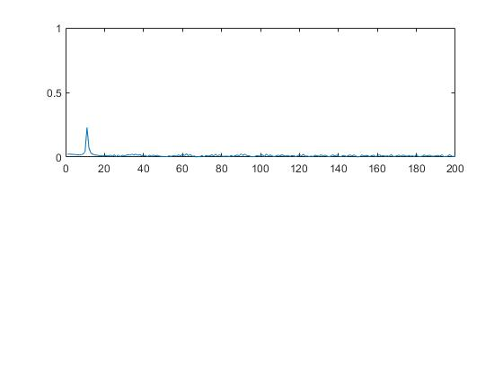
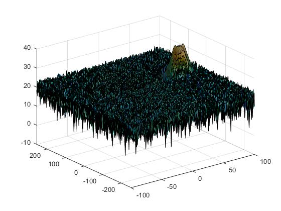
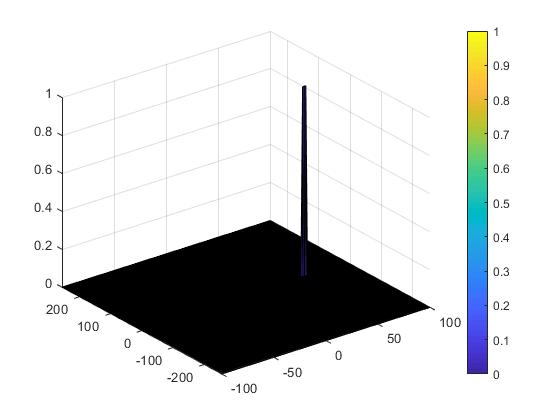

## See my_radar_target_generation_and_detection.m






Create a CFAR README File

In a README file, write brief explanations for the following:

Implementation steps for the 2D CFAR process.
- Norralized RDM map and copied it to singal_after_thresholding structure
- Designed a loop such that it slides the CUT across this normalized range doppler map by giving margins at the edges for Training and Guard Cells.
- On every iteration summed the signal level within all the training cells. 
- Converted the value from logarithmic to linear using db2pow function. 
- Averaged the summed values for all of the training cells used
- After averaging converted it back to logarithimic using pow2db.
- Further added the normalized offset to it to determine the threshold. 
- Compared the signal under CUT with this threshold. If the CUT level > threshold assign it a value of 1, else equate it to 0.

Selection of Training, Guard cells and offset.
- Twekaed Training, Guard and Offset values to remove spurious targts in normalized RDM map
Steps taken to suppress the non-thresholded cells at the edges.
- Zeroed out the cells at the edges that did nto fit into sliding window

```matlab
%Slide Window through the complete Range Doppler Map

% *%TODO* :
%Select the number of Training Cells in both the dimensions.
Tr = 12;
Td = 5;

% *%TODO* :
%Select the number of Guard Cells in both dimensions around the Cell under 
%test (CUT) for accurate estimation
Gr = 4;
Gd = 3;

% *%TODO* :
% offset the threshold by SNR value in dB
offset = 1.4;

% *%TODO* :
%Create a vector to store noise_level for each iteration on training cells
%noise_level = zeros(1,1);


   % Use RDM[x,y] as the matrix from the output of 2D FFT for implementing
   % CFAR
signal_after_threshodling = RDM/max(max(RDM));

for i = Tr+Gr+1:(Nr/2)-(Gr+Tr)
    for j = Td+Gd+1:Nd-(Gd+Td)       
       %Create a vector to store noise_level for each iteration on training cells
        noise_level = zeros(1,1);        
        % Calculate noise SUM in the area around CUT
        for p = i-(Tr+Gr) : i+(Tr+Gr)
            for q = j-(Td+Gd) : j+(Td+Gd)
                if (abs(i-p) > Gr || abs(j-q) > Gd)
                    noise_level = noise_level + db2pow(signal_after_threshodling(p,q));
                end
            end
        end        
        % Calculate threshould from noise average then add the offset
        threshold = pow2db(noise_level/(2*(Td+Gd+1)*2*(Tr+Gr+1)-(Gr*Gd)-1));
        threshold = threshold + offset;
        CUT = signal_after_threshodling(i,j);        
        if (CUT < threshold)
            signal_after_threshodling(i,j) = 0;
        else
            signal_after_threshodling(i,j) = 1;
        end
        
    end
end

% *%TODO* :
% The process above will generate a thresholded block, which is smaller 
%than the Range Doppler Map as the CUT cannot be located at the edges of
%matrix. Hence,few cells will not be thresholded. To keep the map size same
% set those values to 0. 
signal_after_threshodling(union(1:(Tr+Gr),end-(Tr+Gr-1):end),:) = 0; 
signal_after_threshodling(:,union(1:(Td+Gd),end-(Td+Gd-1):end)) = 0;
```
